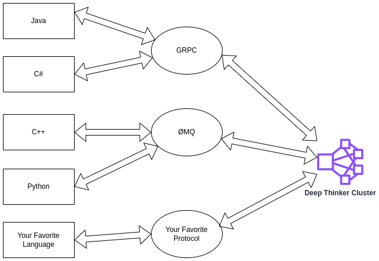

## Overview

Deep Thinker is a high-performance toolkit for Reinforcement Learning 🚀

* Easily develop clustered Reinforcement learning algorithms.
* Connect to Deep Thinker using any language or protocol.

Some example configurations:

Deep Thinker is currently in early development. The API is not stable and will change frequently. For a simple example, check out https://github.com/jt70/deep_thinker/tree/main/cartpole_dqn.

## Coming soon

* Connect with GRPC
* GRPC example
* Implement PPO
